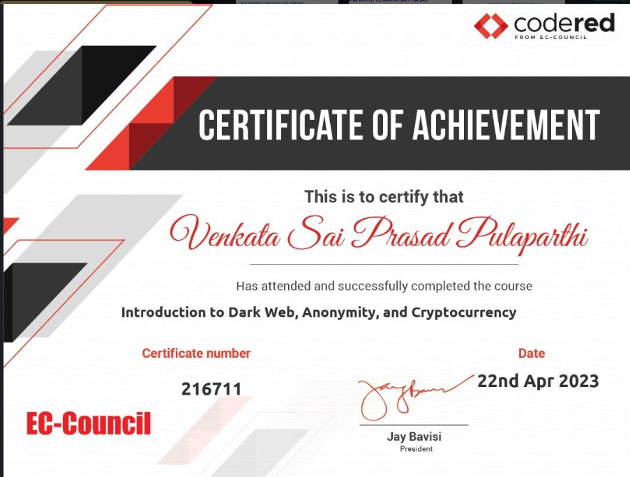
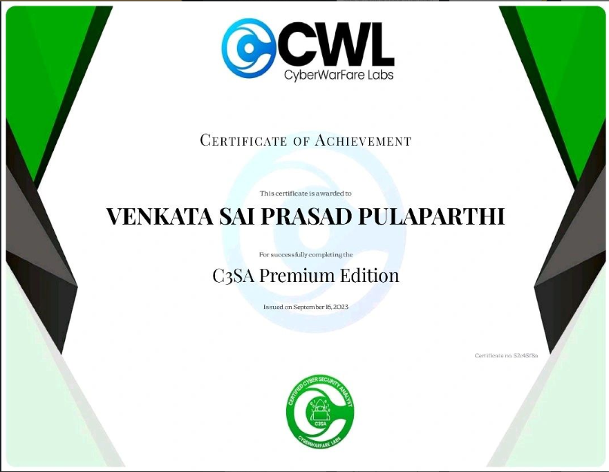
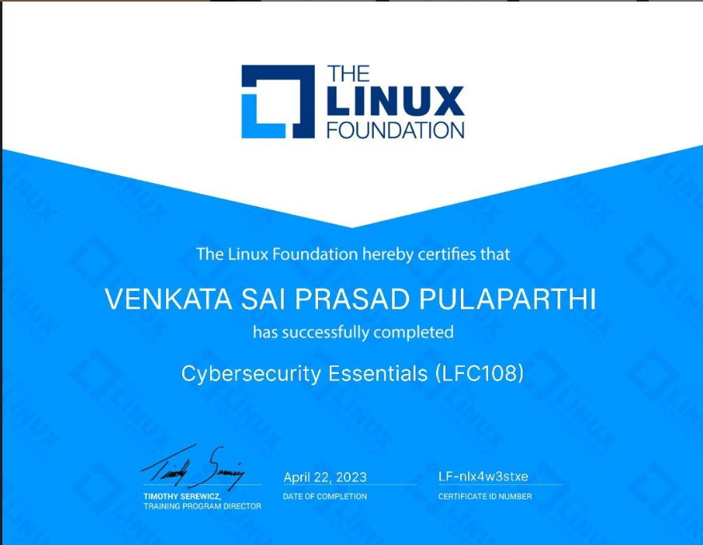
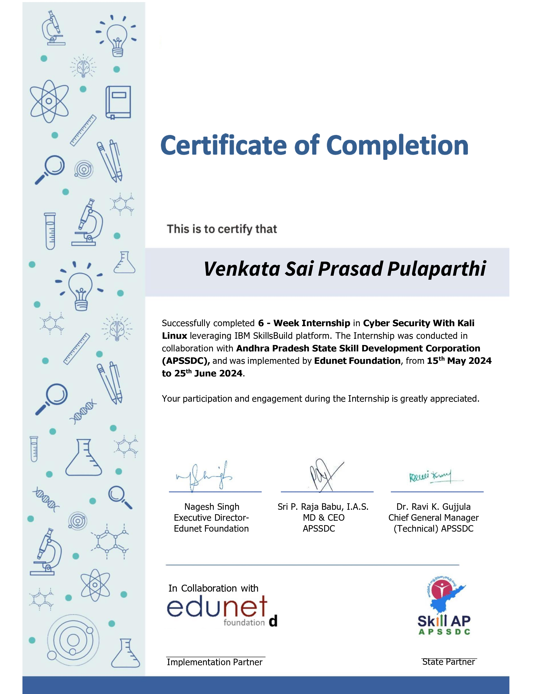

# Cybersecurity Portfolio

Welcome to my Cybersecurity Portfolio! This repository showcases my certifications, practical hands-on learning experiences, and projects in the domain of cybersecurity, ethical hacking, and related fields.

---

## Certifications

I have earned the following certifications, with links to the images of my certificates:

1. **Browser Attacks Protection**  
     
2. **Cisco Cyber Security**  
     
3. **CodeRed Cyber Security Certification**  
     
4. **Cyber Hygiene by Metty**  
     
5. **Cyber Security Commands**  
     
6. **Cybersecurity Analyst**  
     
7. **ISC2 Self-Paced Training**  
     
8. **Kali Fundamentals**  
     
9. **Linux Foundation Cybersecurity Certification**  
     
10. **Palo Alto Cyber Security Certification**  
      
11. **Penetration Testing and Ethical Hacking**  
      

---

## Hands-On Learning

### Practical Experience

- **Kali Linux Installation:** Successfully installed and configured Kali Linux on my laptop for cybersecurity tasks.
- **Keylogger Testing:** Developed and tested keyloggers to understand system vulnerabilities and data security.
- **Password Cracking:** Wrote and executed password-cracking scripts to identify and mitigate weaknesses in password management systems.
- **Bug Identification and Whitehat Hacking:** Conducted ethical hacking exercises to discover and report vulnerabilities.

### Future Plans

I am preparing to write the **Global Certification from ISC2** this year to further solidify my credentials in the cybersecurity field.

---

## Cybersecurity Projects

Here are some of the key projects I have completed:

1. **Network Vulnerability Scanner**  
   - Developed a scanner that detects vulnerabilities in a network using Python and Nmap.  
   - [Project Link](#)

2. **Keylogger Implementation**  
   - Designed a keylogger for educational purposes to study system vulnerabilities and improve data security protocols.  
   - [Project Link](#)

3. **Password Manager with Crack Resistance**  
   - Built a secure password manager with features to resist common password-cracking techniques.  
   - [Project Link](#)

4. **Bug Bounty Reports**  
   - Submitted multiple bug bounty reports on major tech platforms and successfully identified security flaws.  
   - [Project Link](#)

---

## Internship Work

Below are links to my internship experiences and related work:

1. **AICTE Cybersecurity Internship**  
     

2. **APSSDC Cybersecurity Internship**  
     

---

